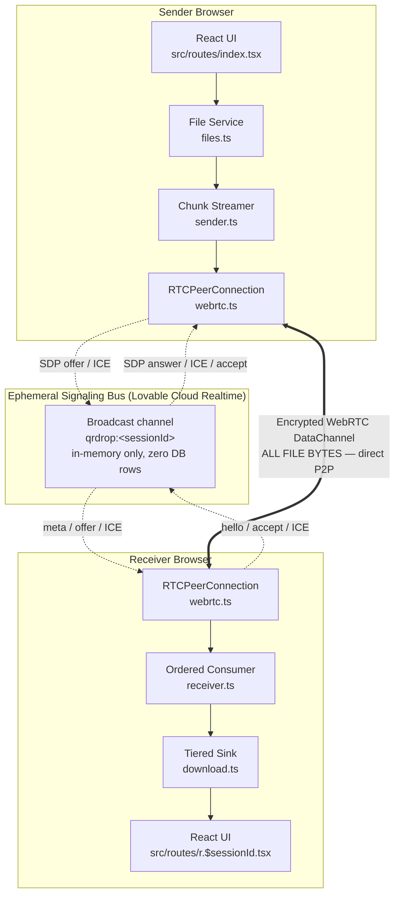

# QRDrop

**Scan a QR code. Send the file. Nothing touches a server.**

QRDrop is a browser-to-browser peer-to-peer file transfer app. One device picks files (or a whole
folder), the other scans a QR code, and the bytes stream **directly between the two browsers** over a
WebRTC DataChannel. No accounts, no uploads, no cloud storage, no file size ceiling.

---

## Table of contents

1. [Problem statement](#problem-statement)
2. [Architecture overview](#architecture-overview)
3. [Technical deep dive](#technical-deep-dive)
   - [1. Ephemeral signaling](#1-ephemeral-signaling)
   - [2. Custom binary wire protocol](#2-custom-binary-wire-protocol)
   - [3. Memory and backpressure flow control](#3-memory-and-backpressure-flow-control)
   - [4. Receiver async queue serialization](#4-receiver-async-queue-serialization)
   - [5. Tiered storage strategy](#5-tiered-storage-strategy)
   - [6. WebRTC ICE queue](#6-webrtc-ice-queue)
   - [7. Directory traversal and relative paths](#7-directory-traversal-and-relative-paths)
   - [8. STUN / TURN configuration](#8-stun--turn-configuration)
4. [Pros and cons](#pros-and-cons)
5. [Project structure](#project-structure)
6. [Local development](#local-development)
7. [Environment variables](#environment-variables)
8. [Deployment](#deployment)
9. [Demo script](#demo-script)
10. [Troubleshooting](#troubleshooting)

---

## Problem statement

AirDrop is excellent — inside one ecosystem. The moment a transfer crosses an ecosystem boundary
(iPhone → Windows laptop, Android → Mac, Linux → iPad), people fall back to workarounds that are all
worse:

| Workaround | What goes wrong |
|---|---|
| Email attachment | 25 MB cap, mangled folder structure, copies live in two mailboxes forever |
| Cloud drive (Drive/Dropbox/WeTransfer) | Full upload + full download, an account, quota limits, and a plaintext copy sitting on a third-party disk |
| Messaging apps | Aggressive image/video recompression, no folders, size caps |
| USB stick / cable | Requires physical hardware and the right port; useless between phones |

All of them route a private file through infrastructure the sender does not control, and all of them
pay for the file twice: once up, once down.

**QRDrop's answer:** the two devices talk to each other. A tiny, ephemeral coordination channel
introduces them (a few kilobytes of SDP and ICE metadata), then it gets out of the way. The file
payload travels over an encrypted DTLS/SCTP DataChannel between the two browsers. There is no bucket
to leak, no retention policy to read, and no bandwidth bill to pay.

**What it solves**

- Cross-ecosystem transfer with no app install on either side — it is a web page.
- Files of arbitrary size (limited only by the receiver's disk, not by RAM or a plan tier).
- Whole folders, with the directory hierarchy preserved on arrival.
- Zero accounts, zero sign-in, zero tracking of what was sent.
- Zero marginal cost to operate: the server never sees a byte of file data.

---

## Architecture overview



Signaling is dotted (kilobytes, transient). The file path is the thick line, and it never enters the
diagram's middle box.

### Session lifecycle

```text
 SENDER                        SIGNALING BUS                       RECEIVER
   |                                 |                                  |
   | select files, mint sessionId    |                                  |
   | render QR -> /r/<sessionId>     |                                  |
   | subscribe qrdrop:<sessionId>    |                                  |
   |-------------------------------->|                                  |
   |                                 |<---- scan QR, open /r/<id> ------|
   |                                 |<---------- hello ----------------|
   |------------- meta ------------->|--------- meta (file list) ------>| user reviews list
   |                                 |<--------- accept ----------------| (user gesture:
   |                                 |                                  |  picks save target)
   | createOffer / setLocalDesc      |                                  |
   |------------- offer ------------>|------------- offer ------------->| setRemoteDesc
   |<------------ answer ------------|<------------ answer -------------| createAnswer
   |<===========  ICE candidates (trickle, both ways)  ===============>|
   |                                 |                                  |
   |###############  DataChannel open — signaling idle  ###############|
   | 0x01 METADATA                                                     ->|
   | 0x02 CHUNK x N (16 KB)                                            ->| write via sink
   | 0x03 FILE_COMPLETE (per file)                                     ->| close + finalize
   | 0x04 TRANSFER_COMPLETE                                            ->|
   |<-                                                        0x06 ACK  | all bytes persisted
   | done                                                               | download / saved
```

### Stack

| Layer | Choice |
|---|---|
| Framework | TanStack Start v1 (React 19, file-based routing, SSR) |
| Build | Vite 7, Tailwind CSS v4 (`src/styles.css` theme tokens) |
| Transport | WebRTC DataChannel (DTLS + SCTP, encrypted by spec) |
| Signaling | Lovable Cloud Realtime broadcast (`self: false`, `ack: false`) |
| QR render | `react-qr-code` — pure SVG, crisp on any DPI |
| QR scan | `qr-scanner` (Nimiq) — native `BarcodeDetector` where available, worker ZXing fallback |
| Icons / UI | lucide-react, shadcn-style primitives |

---

## Technical deep dive

### 1. Ephemeral signaling

**File:** `src/lib/transfer/signaling.ts`

WebRTC cannot bootstrap itself: the two peers must exchange an SDP offer/answer and a stream of ICE
candidates before a direct socket exists. QRDrop uses a Lovable Cloud Realtime **broadcast** channel
for exactly that, and nothing else.

```ts
const channel = supabase.channel(`qrdrop:${sessionId}`, {
  config: { broadcast: { self: false, ack: false } },
});
```

Properties that matter:

- **Zero database persistence.** There is no table, no row, no insert. Broadcast messages are relayed
  in memory between currently-subscribed clients and then discarded. Close both tabs and the session
  is gone — there is no record it happened.
- **Session id as capability.** `generateSessionId()` draws 10 characters from a 31-symbol
  unambiguous alphabet (`abcdefghjkmnpqrstuvwxyz23456789`, no `i/l/o/0/1`) via
  `crypto.getRandomValues` — roughly 49 bits of entropy. Knowing the id is the only way to reach the
  channel, and it lives only in the QR code.
- **Role-tagged envelopes.** Every message is `{ role: "sender" | "receiver", msg }`, and each side
  drops envelopes carrying its own role. A peer never processes its own echo.
- **Small, fixed vocabulary:** `hello`, `meta`, `busy`, `accept`, `reject`, `cancel`, `offer`,
  `answer`, `ice`, `bye`. No file bytes are representable in this union — the protocol makes leaking
  payload through the bus structurally impossible.
- **`ready` gate.** `send()` awaits the subscription promise, so an offer minted before `SUBSCRIBED`
  is not dropped on the floor.

### 2. Custom binary wire protocol

**File:** `src/lib/transfer/protocol.ts`

JSON over the DataChannel would base64-inflate binary payloads by ~33% and cost a parse per chunk.
QRDrop uses a one-byte-tagged binary framing instead.

| Tag | Message | Layout |
|---|---|---|
| `0x01` | `METADATA` | `[0x01][JSON utf-8]` — file list, total bytes, sender label |
| `0x02` | `CHUNK` | `[0x02][fileIndex u16 BE][chunkIndex u32 BE][payload ≤ 16 KB]` |
| `0x03` | `FILE_COMPLETE` | `[0x03][fileIndex u16 BE]` |
| `0x04` | `TRANSFER_COMPLETE` | `[0x04]` |
| `0x05` | `ERROR` | `[0x05][message utf-8]` |
| `0x06` | `ACK` | `[0x06]` — receiver → sender, "everything is on disk" |

Design notes:

- **7-byte chunk header.** `u16` file index (65 536 files per session) plus `u32` chunk index
  (2<sup>32</sup> × 16 KB ≈ 64 TB per file) — 0.04% overhead on a full chunk.
- **`CHUNK_SIZE = 16 KB` for iOS compatibility.** WebKit's SCTP stack misbehaves on messages above
  ~64 KB (silent drops and reassembly bugs); 16 KB is the size every engine handles cleanly, and it
  sits comfortably under the 16 KB `maxMessageSize` floor negotiated by conservative peers.
- **`FILE_COMPLETE` is mandatory even for empty files.** A zero-byte file emits no chunks, so the
  marker is what tells the receiver to open, close, and finalize it. Without it, empty files silently
  vanish from a folder transfer.
- **ACK closes the loop.** The sender does not report success on the last `send()` call — a queued
  SCTP write is not a written file. It waits for `0x06`, which the receiver emits only after every
  sink has been closed and finalized.
- **`ERROR` is bidirectional.** Either side can surface a human-readable failure over the same
  channel rather than leaving the peer to time out.

### 3. Memory and backpressure flow control

**File:** `src/lib/transfer/sender.ts`

Sending a 40 GB file must not use 40 GB of RAM, and it must not overflow the SCTP send buffer
(browsers cap around 16 MB and then throw or silently stall).

Two nested loops handle this:

```text
outer: file.slice(offset, offset + 1 MB).arrayBuffer()   <- READ_BLOCK_SIZE, disk -> heap
  inner: block.subarray(i, i + 16 KB)                    <- CHUNK_SIZE, heap -> wire
         if (dc.bufferedAmount > 1 MB) await waitForDrain()
```

- **1 MB slice blocks.** `File.slice()` is lazy — only the requested megabyte is ever materialized.
  Peak heap stays around a megabyte regardless of file size, on both desktop and mobile.
- **1 MB high watermark / 64 KB low threshold.** When `bufferedAmount` exceeds 1 MB the loop parks;
  it resumes once the buffer drains below `bufferedAmountLowThreshold = 64 KB`. This keeps the pipe
  saturated while never letting the browser's queue balloon.
- **Native event + 50 ms polling fallback.** `waitForDrain()` listens for `bufferedamountlow`, *and*
  runs a 50 ms interval that checks `bufferedAmount` directly. Several engines (notably older
  WebKit) fire `bufferedamountlow` unreliably or not at all; without the poll, a large transfer
  deadlocks at the first pause. The same interval detects `readyState !== "open"` and rejects, so a
  peer disappearing mid-pause surfaces as an error instead of a hang.
- **Cooperative cancellation.** An `AbortSignal` is checked at every block boundary and is wired into
  both the drain wait and the ACK promise, so Cancel is immediate rather than "after this file".
- **Live metrics.** `onProgress` fires per chunk; `src/lib/transfer/metrics.ts` keeps a rolling
  window to derive instantaneous speed, ETA, and elapsed time without jittering on every packet.

### 4. Receiver async queue serialization

**File:** `src/lib/transfer/receiver.ts`

`RTCDataChannel.onmessage` is a **synchronous** callback, but every write path (`FileSystemWritable`,
OPFS) is **asynchronous**. Handling messages with a bare `async` listener means the browser fires
the next `onmessage` while the previous `await sink.write()` is still pending — chunks then race and
land out of order, silently corrupting the file.

The fix is a single-lane promise chain:

```ts
let queue: Promise<void> = Promise.resolve();

dc.addEventListener("message", (e) => {
  const data = e.data as ArrayBuffer;
  queue = queue.then(() => handle(data)).catch(fail);
});
```

Every message is appended to one chain, so `handle()` executions never overlap, in arrival order. On
top of that:

- **Strict ordering assertion.** Each open file tracks `expectedChunk`; a mismatch throws
  `Out-of-order chunk for file N` instead of writing garbage. Corruption becomes a loud failure.
- **Lazy sink opening.** A file's sink is created on its first chunk (or on `FILE_COMPLETE` for empty
  files), so no handles are held open for files not yet reached.
- **Failure fan-out.** `fail()` is idempotent, pushes an `0x05 ERROR` back to the sender, and rejects
  the transfer promise. Channel `close` before completion is treated as a failure, not a success.

### 5. Tiered storage strategy

**File:** `src/lib/transfer/download.ts`

The receiver picks the best available save mechanism at accept time — and crucially, **from inside
the user's click**, because native pickers require a user gesture.

**Tier 1 — File System Access API** (Chromium desktop, Chrome Android)
- Single file → `showSaveFilePicker()`; multiple files/folders → `showDirectoryPicker({ mode: "readwrite" })`.
- Bytes stream straight into the user's real filesystem. `resolveDirectory()` recreates nested
  folders with `getDirectoryHandle(seg, { create: true })`, so `photos/2024/a.jpg` lands correctly.
- `savedDirectly: true` — nothing to download afterwards.
- A dismissed picker (`AbortError`) is not an error; it falls through to Tier 2.

**Tier 2 — OPFS** (Safari, Firefox)
- `navigator.storage.getDirectory()` gives an origin-private sandbox on **disk**, so a 20 GB transfer
  uses ~0 JS heap. Capability is verified with a real probe file, not a feature sniff.
- Files are staged under `qrdrop-<sessionId>/<index>`, then exposed via
  `URL.createObjectURL(await handle.getFile())` for a one-click save.
- `dispose()` removes the staging folder; `cleanupStaleOpfs()` sweeps orphaned `qrdrop-*` folders
  from crashed sessions on load.

**Tier 3 — in-memory Blob** (universal last resort)
- Chunks accumulate in an array, assembled into a `Blob` at completion. Bounded by available RAM —
  fine for documents and photos, unsuitable for multi-gigabyte video.

**BufferedSink — the 1 MB flush optimization**

A naive sink issues one `writable.write()` per 16 KB chunk: 65 536 async disk operations per
gigabyte, each with promise and syscall overhead. `BufferedSink` coalesces chunks in memory and
flushes a single merged `Uint8Array` once 1 MB has accumulated (and again on `close()`), cutting
write calls by 64× at the cost of one megabyte of buffer. Incoming views are copied with `.slice()`
because a `subarray` of the received frame is only valid until the next message.

### 6. WebRTC ICE queue

**File:** `src/lib/transfer/webrtc.ts`

Trickle ICE means candidates start flowing the instant gathering begins — routinely **before** the
peer has applied the remote SDP. Calling `addIceCandidate()` in that window throws
`InvalidStateError`, and every candidate dropped that way is a connection path lost, which shows up
as intermittent "works on my network" flakiness.

`IceQueue` removes the race:

```ts
class IceQueue {
  async add(c)         { if (!this.remoteSet) { this.pending.push(c); return; } ... }
  async remoteReady()  { this.remoteSet = true; for (const c of this.pending) await this.add(c); }
}
```

Candidates arriving early are buffered; `remoteReady()` is called right after
`setRemoteDescription()` and replays the backlog in order. Individual `addIceCandidate` failures are
warned, never fatal — one stale candidate must not kill an otherwise viable connection.

Companion helpers: `createPeerConnection()` (with `bundlePolicy: "max-bundle"` and state logging),
`waitForChannelOpen()` (30 s timeout, so a dead connection fails with a message instead of spinning),
and `configureChannel()` (forces `binaryType = "arraybuffer"` — the Blob default would break the
binary decoder).

### 7. Directory traversal and relative paths

**File:** `src/lib/transfer/files.ts`

Sending "a folder" only works if the hierarchy survives. Three input routes all normalize to the same
`SelectedFile { file, path }` shape:

- **Drag and drop** — `DataTransferItem.webkitGetAsEntry()` yields a `FileSystemEntry` tree, walked
  recursively with `FileSystemDirectoryReader.readEntries()`. That reader returns **at most 100
  entries per call**, so it must be called in a loop until it returns empty — the classic bug is a
  large folder silently truncating to its first 100 files.
- **Folder picker** — `<input webkitdirectory>` exposes `file.webkitRelativePath`.
- **File picker** — plain multi-select; `path` falls back to the bare filename.

`buildMeta()` then freezes each entry's `index`, `name`, `path`, `size`, and `type` into the
`0x01 METADATA` frame. The receiver rebuilds those exact paths on the FSA tier and preserves them in
the displayed file list on the OPFS/Blob tiers.

### 8. STUN / TURN configuration

**File:** `src/lib/ice.functions.ts` (a TanStack `createServerFn`, so credentials stay server-side)

STUN is always on, with two independent providers for redundancy:

```
stun:stun.cloudflare.com:3478
stun:stun.l.google.com:19302
```

STUN alone solves most home and office networks. Roughly 15–20% of real-world pairs — symmetric NAT,
carrier-grade NAT on mobile data, strict corporate firewalls — cannot hole-punch and need a **TURN**
relay. When `TURN_URL`, `TURN_USERNAME`, and `TURN_CREDENTIAL` are all present, the server function
appends the relay to the ICE list and reports `hasTurn: true` to the UI. `TURN_URL` accepts a
comma-separated list (e.g. a UDP and a TCP/443 endpoint) for restrictive networks.

Note that TURN relays *encrypted* DTLS frames; the relay operator can see traffic volume and
endpoints, never plaintext content.

---

## Pros and cons

### Pros

- **$0 server bandwidth and storage.** The backend relays a handful of signaling messages per
  session. Transferring 100 GB costs the same as transferring 100 KB: nothing.
- **True end-to-end privacy.** File bytes exist in exactly two places — the sender's disk and the
  receiver's. DTLS encryption is mandatory in WebRTC, and no intermediary holds a decryptable copy.
- **Unlimited file size.** With FSA or OPFS the ceiling is the receiver's free disk space; RAM usage
  stays around 1–2 MB thanks to slice-based reads and buffered disk flushes.
- **Zero accounts, zero friction.** No sign-up, no email, no app install. Open a page, scan a code.
- **Cross-platform folder support.** Nested directory structures survive intact between any two
  ecosystems — something AirDrop and most messengers do not offer.
- **Ephemeral by construction.** No database rows, no history, nothing to subpoena or breach.
- **Verifiable completion.** The ACK handshake means "done" means *written to disk*, not *queued*.

### Cons and limitations

- **Both peers must stay online and awake.** There is no store-and-forward. If the sender closes the
  tab, locks the phone, or lets the screen sleep mid-transfer, the transfer dies. A **Screen Wake
  Lock** (`navigator.wakeLock.request("screen")`) is the recommended mitigation and is the top
  candidate for the next iteration; background-tab throttling on mobile is the practical risk.
- **Strict/symmetric NAT requires TURN.** Without a configured relay, an estimated 15–20% of pairs —
  especially cellular CGNAT and locked-down corporate Wi-Fi — will fail to connect. TURN reintroduces
  a bandwidth cost (though not a privacy one).
- **iOS Safari lacks the File System Access API.** iPhones and iPads fall back to OPFS staging plus a
  manual download tap per file, rather than seamless streaming to a chosen destination. Large
  transfers to iOS are also subject to per-origin storage quotas.
- **No resume.** A dropped connection restarts the transfer from zero; chunk indices are validated
  but not checkpointed.
- **Single receiver per session.** One-to-many fan-out is not implemented; a second joiner gets
  `busy`.
- **No content integrity hash.** SCTP guarantees ordered, error-checked delivery, but there is no
  end-to-end SHA-256 comparison of the final file.
- **Requires modern browsers.** WebRTC DataChannels, and camera access for scanning, which browsers
  only grant on HTTPS (or `localhost`).

---

## Project structure

```text
src/
├── routes/
│   ├── __root.tsx           App shell: theme, fonts, nav, error boundaries
│   ├── index.tsx            Sender: pick files → QR code → live progress
│   ├── r.$sessionId.tsx     Receiver: review → accept → save
│   └── scan.tsx             Camera QR scanner with manual link fallback
├── hooks/
│   ├── useSender.ts         Sender state machine (signaling → offer → stream)
│   └── useReceiver.ts       Receiver state machine (hello → accept → sink → save)
├── lib/
│   ├── ice.functions.ts     Server function returning STUN/TURN config
│   └── transfer/
│       ├── protocol.ts      Binary framing, message types, session ids
│       ├── signaling.ts     Realtime broadcast signaling channel
│       ├── webrtc.ts        Peer connection, IceQueue, channel helpers
│       ├── sender.ts        Chunked streaming with backpressure + ACK
│       ├── receiver.ts      Serialized ordered consumer
│       ├── download.ts      FSA / OPFS / Blob tiers + BufferedSink
│       ├── files.ts         Folder traversal, relative paths
│       └── metrics.ts       Speed, ETA, elapsed, formatters
└── components/qrdrop/       QRPanel, QRScanner, FileDropzone, FileList,
                             TransferProgress, StatusBadge, ThemeToggle, Logo
```

---

## Local development

Requirements: Node.js 20+ (or Bun) and npm.

```sh
git clone <this-repository-url>
cd qrdrop
npm install
npm run dev          # http://localhost:8080
```

| Script | Purpose |
|---|---|
| `npm run dev` | Vite dev server with HMR |
| `npm run build` | Production build |
| `npm run build:dev` | Development-mode build (useful for prerender debugging) |
| `npm run preview` | Serve the production build locally |
| `npm run lint` | ESLint |
| `npm run format` | Prettier |

### Testing a real transfer locally

WebRTC and the camera both require a secure context. `localhost` counts as secure, so two browser
windows on the same machine work for signaling and transfer:

1. Open `http://localhost:8080` in window A, drop a file.
2. Copy the link from under the QR code, open it in window B (a different profile or an incognito
   window, so the two tabs behave as distinct peers).
3. Accept in window B.

To test **from a phone**, `localhost` will not do — the phone needs an HTTPS origin. Either use the
deployed preview URL, or tunnel (`cloudflared tunnel --url http://localhost:8080`). Plain
`http://<lan-ip>:8080` will block the camera and may block WebRTC.

Note: headless/CI browsers typically gather no ICE candidates, so end-to-end transfer cannot be
verified in a sandboxed container — signaling and UI can, and the chunking/reassembly layer is
verifiable in isolation against an in-memory channel.

---

## Environment variables

Backend connection values are provisioned automatically by Lovable Cloud and written to `.env`:

| Variable | Scope | Purpose |
|---|---|---|
| `VITE_SUPABASE_URL` | client | Realtime endpoint for the signaling channel |
| `VITE_SUPABASE_PUBLISHABLE_KEY` | client | Publishable key (safe in the bundle) |
| `VITE_SUPABASE_PROJECT_ID` | client | Project identifier |
| `SUPABASE_URL` / `SUPABASE_PUBLISHABLE_KEY` / `SUPABASE_PROJECT_ID` | server | SSR equivalents |

Optional TURN relay — read **server-side only**, inside `getIceServers()`, so credentials never reach
the browser bundle. Add them as backend secrets, not to `.env`:

| Variable | Example | Purpose |
|---|---|---|
| `TURN_URL` | `turn:relay.example.com:3478,turns:relay.example.com:443?transport=tcp` | One or more comma-separated relay URLs |
| `TURN_USERNAME` | `qrdrop` | TURN username (ideally a short-lived credential) |
| `TURN_CREDENTIAL` | `••••••••` | TURN password/secret |

All three must be set; if any is missing, QRDrop runs STUN-only and the UI reports no relay
available. Compatible providers include Cloudflare Calls, Metered.ca, Twilio NTS, or self-hosted
Coturn.

---

## Deployment

QRDrop is a TanStack Start app targeting an edge runtime.

1. **Publish from Lovable** — the built app is served over HTTPS with the Cloud backend already
   bound. Preview and production share one backend instance.
2. **Add TURN secrets** (optional but strongly recommended for public use) in the backend secrets
   panel: `TURN_URL`, `TURN_USERNAME`, `TURN_CREDENTIAL`. No redeploy of client code is needed —
   `getIceServers()` reads them at call time.
3. **Custom domain** — attach one if you want the QR links to carry your own hostname. Shorter
   origins produce visually simpler, faster-scanning QR codes.
4. **No database migrations are required.** QRDrop creates no tables; Realtime broadcast needs no
   schema.

Self-hosting elsewhere works too: `npm run build`, then deploy the output to any host that supports
the framework's edge server entry, with the same environment variables set.

---

## Demo script

A five-minute live demo that lands the point. Use a laptop (projected) and a phone on **cellular
data**, not the venue Wi-Fi — proving it crosses networks is the whole show.

**0:00 — The problem (30 s).**
"I have a 4 GB video on my iPhone and I need it on this Windows laptop. Email says no. WeTransfer
wants an upload, a download, and my email address. AirDrop doesn't know Windows exists."

**0:30 — Send (45 s).**
On the laptop, drag a *folder* (not just a file) onto the drop zone. Point out the file list with
nested paths and the total size. A QR code appears instantly — note that nothing has uploaded,
because there is nowhere to upload to.

**1:15 — Receive (45 s).**
Scan the code with the phone camera. The phone shows the sender's device name and the exact file
manifest *before* accepting — consent first, bytes second. Tap **Accept**.

**2:00 — The transfer (60 s).**
Watch live speed, ETA, and per-file progress. Call out the number: on a decent local network this
runs at LAN speed, far faster than any upload-then-download round trip.

**3:00 — The proof (60 s).**
Open the browser devtools Network tab and show it is *quiet* — no request carrying the payload. Then
open `chrome://webrtc-internals` and show the DataChannel counters climbing. This is the moment the
claim becomes visible: the bytes went peer to peer.

**4:00 — Privacy and cost (45 s).**
"The server saw about two kilobytes of connection metadata and stored none of it. There is no
database row for this transfer. Serving this to a million users costs the same as serving it to
one."

**4:45 — Honest limits (15 s).**
Both devices stay open during the transfer, and about one connection in six on strict mobile
networks needs a TURN relay — which is a config value, and still cannot read the file.

**Backup plan:** demos die on hostile Wi-Fi. Keep a second tab already paired, and have a screen
recording of a successful large transfer ready.

---

## Troubleshooting

| Symptom | Likely cause | Fix |
|---|---|---|
| "Timed out opening data channel" | No usable ICE path (symmetric NAT / firewall) | Configure TURN; try both devices on the same Wi-Fi to confirm |
| Camera never starts on the scan page | Page not served over HTTPS, or permission denied | Use the HTTPS URL; re-grant camera permission in site settings |
| Transfer stalls at a fixed percentage | Peer's tab backgrounded or screen locked | Keep both screens awake and both tabs in the foreground |
| Files download one by one instead of saving to a folder | Browser lacks the File System Access API (Safari/Firefox/iOS) | Expected — OPFS tier; save each file, or use a Chromium browser |
| "Out-of-order chunk for file N" | Underlying channel reordering (should not happen on SCTP) | Retry the transfer; report with browser and OS versions |
| "Sender disconnected before the transfer finished" | Sender tab closed, navigated, or lost network | Restart the transfer from the sender |

---

## Privacy summary

- File contents never reach any server, in any tier, at any time.
- Signaling carries only SDP, ICE candidates, a file manifest, and control words — held in memory,
  never written to a database.
- Session ids are cryptographically random and exist only in the QR code and the two open tabs.
- No accounts, no cookies for identity, no transfer history, nothing to delete afterwards.
- 
---

## Deployment link
- https://qr-application.riseinspirethrive2008.workers.dev/


